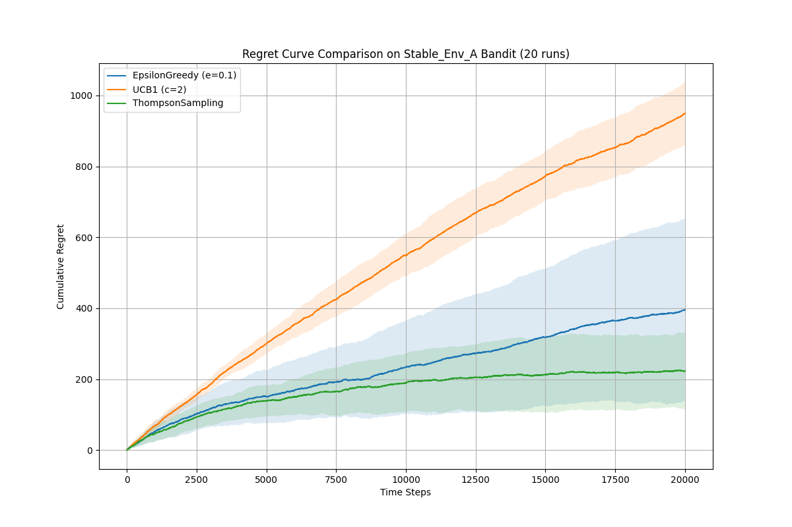

# Report Title (Topic 4: Stochastic + Adversarial Multi-Armed Bandits)

**Team members:** 赵朝彬  
**Topic:** (4)  
**Reproducibility:** (python main.py)

## 1. Problem statement

This project addresses the classic multi-armed bandit (MAB) problem, a fundamental challenge in reinforcement learning that exemplifies the exploration-exploitation trade-off. We consider a stochastic bandit environment with a finite set of $K$ arms (actions). At each time step $t \in \{1, 2, ..., T\}$, an agent selects an arm $I_t \in \{1, 2, ..., K\}$. Upon selection, the agent receives a reward $r_t$ drawn from a fixed but unknown probability distribution associated with that arm.

Specifically, we focus on the **Bernoulli bandit** setting. For each arm $k$, the rewards are drawn from a Bernoulli distribution with a mean $\mu_k$, i.e., $r_t \sim \mathrm{Bernoulli}(\mu_{I_t})$. The agent's objective is to maximize the cumulative reward $\sum_{t=1}^{T} r_t$.

This objective is equivalent to minimizing the total **cumulative regret**, $R_T$, which measures the difference between the expected reward of the optimal strategy (always playing the best arm) and the agent's actual cumulative reward. The cumulative regret is defined as:

$$
R_t = \sum_{s=1}^{t} \left(\mu_s^\star - r_s\right)
$$

where $\mu^\star = \max_{k \in \{1, ..., K\}} \mu_k$ is the mean reward of the best arm. The goal is to design an algorithm that makes the regret grow as slowly as possible.

In Environment A (stationary), $\mu_s^\star = 0.60$ for all $s$.
In Environment B (non-stationary), $\mu_s^\star$ changes over time because the identity of the best arm switches every 4,000 steps (dynamic-oracle regret).

## 2. Methods

To tackle the Bernoulli bandit problem, we implemented and evaluated three distinct algorithms. At least two of these are our own implementations of the core update rules, as required.

### 2.1 Implemented Algorithms ("Ours")

The following algorithms were implemented from scratch:

*   **UCB1 (Upper Confidence Bound 1):** An optimistic algorithm that selects arms based on an upper confidence bound of their potential reward. The UCB score for each arm $k$ at time $t$ is calculated as $\bar{\mu}_k + c \sqrt{\frac{\ln(t)}{N_k(t)}}$, where $\bar{\mu}_k$ is the empirical mean reward, $N_k(t)$ is the number of times arm $k$ has been pulled, and $c$ is an exploration parameter.

*   **Thompson Sampling:** A Bayesian algorithm that maintains a posterior distribution of the reward probability for each arm. For Bernoulli rewards, this is modeled using a Beta distribution, $\mathrm{Beta}(\alpha_k, \beta_k)$. At each step, the algorithm samples a value from each arm's posterior distribution and plays the arm with the highest sample. The posterior is then updated based on the observed reward.

### 2.2 Baseline Algorithm

We also implemented a standard baseline algorithm for comparison:

*   **Epsilon-Greedy (ε-Greedy):** A simple yet effective baseline that balances exploration and exploitation. With probability $1-\epsilon$, it exploits by choosing the arm with the highest current estimated value. With probability $\epsilon$, it explores by selecting a random arm uniformly.

## 3. Experimental Setup

All experiments were conducted to compare the algorithms across two distinct environments as required.

*   **Environments:**
    *   **Environment A (Stationary):** A stochastic bandit environment with $K=10$ arms. The optimal arm's mean reward was fixed at $\mu^\star = 0.60$, while the means of the other means are linearly spaced in $[0.45, 0.58]$. The reward probabilities were constant throughout the run.
    *   **Environment B (Non-Stationary):** The identity of the best arm changed every 4,000 time steps. For each run, we first sample baseline means for all arms with $\mu_k^{base} \sim \mathrm{Uniform}(0.45, 0.58)$. In each stage, one arm is set to $\mu=0.60$ (stage-optimal), while other arms keep their baseline means.

*   **Horizon and Repetitions:** For both environments, each algorithm was run for a total of $T=20,000$ time steps. To obtain robust results, each experiment was repeated for $N=20$ independent runs.

*   **Algorithm Hyperparameters:**
    *   **Epsilon-Greedy:** $\epsilon = 0.1$.
    *   **UCB1:** $c = 2$.
    *   **Thompson Sampling:** Priors $\alpha_k=1, \beta_k=1$ for all arms.

*   **Reproducibility & Artifacts:** A global random seed (`RANDOM_SEED = 42`) was used for reproducibility. All results were saved to the `results/` directory and plots to the `figures/` directory, with filenames clearly distinguishing between Environment A and B.
## 4. Results

We present the performance of the algorithms separately for the stationary and non-stationary environments.

### 4.1 Performance in Stationary Environment (A)

In the stable environment where reward probabilities are fixed, the final cumulative regret is summarized in Table 1 and the learning curves are shown in Figure 1.

**Table 1:** Final Cumulative Regret (Mean ± Std. Dev.) in Environment A

| Algorithm             | Final Cumulative Regret (Mean ± Std.) | Runtime (s/run) |
| --------------------- | ------------------------------------: | --------------: |
| EpsilonGreedy (ε=0.1) |                        949.65 ± 89.06 |          0.1205 |
| **UCB1 (c=2)**        |                   **223.23 ± 108.17** |          0.3540 |
| Thompson Sampling     |                       395.75 ± 256.18 |          0.4595 |

Runtime is wall-clock time per run averaged from the recorded totals (20 runs).

**Figure 1:** Regret Curves in Stationary Environment (A)

### 4.2 Performance in Non-Stationary Environment (B)

In the environment where the best arm changes every 4,000 steps, the performance landscape shifted dramatically, as shown in Table 2 and Figure 2.

**Table 2:** Final Cumulative Regret (Mean ± Std. Dev.) in Environment B

| Algorithm             | Final Cumulative Regret (Mean ± Std.) | Runtime (s/run) |
| --------------------- | ------------------------------------: | --------------: |
| EpsilonGreedy (ε=0.1) |                      1102.55 ± 145.28 |          0.1379 |
| **UCB1 (c=2)**        |                   **864.70 ± 270.98** |          0.3705 |
| Thompson Sampling     |                      1072.40 ± 312.45 |          0.4758 |

Runtime is wall-clock time per run averaged from the recorded totals (20 runs).

**Figure 2:** Regret Curves in Non-Stationary Environment (B)

As expected, all algorithms incurred significantly higher regret in the non-stationary environment. However, UCB1 achieved the lowest final cumulative regret in this setting. The "steps" in the regret curves in Figure 2 clearly correspond to the points where the environment changed, forcing the algorithms to re-adapt.
## 5. Discussion

From the regret curves, the stationary environment (Env A) clearly separates the three strategies. UCB1 achieves the fastest reduction of regret growth rate over time and ends with the lowest final regret. This is consistent with the optimism-in-face-of-uncertainty principle: early exploration is automatically reduced once enough evidence is collected, so the algorithm concentrates pulls on the best arm. Thompson Sampling is competitive but shows larger variability across runs, which can lead to higher average cumulative regret in this setting. In contrast, $\varepsilon$-greedy keeps exploring with a constant probability, so even late in the horizon it continues to waste pulls on suboptimal arms, resulting in a nearly linear regret accumulation.

In the non-stationary environment (Env B), the regret curves increase substantially for all methods, and the slope of regret tends to change around the switching points (every 4,000 steps). Each switch effectively makes the previously “best-looking” arm suboptimal, so the algorithms must re-discover the new optimal arm, causing additional regret. Although none of the three methods is explicitly designed for non-stationarity (e.g., no discounting / sliding window / restart), UCB1 still obtains the lowest final regret in our experiments. A plausible reason is that Env B only changes a small number of times (4 switches over the whole horizon) and the suboptimal means remain bounded within $[0.45, 0.58]$, so after each change UCB1 can re-establish confidence in the new best arm without facing continuously drifting rewards. Thompson Sampling can adapt as well, but its posterior may take longer to “forget” a previously good arm under abrupt switches when no explicit forgetting mechanism is used. $\varepsilon$-greedy can re-discover after changes due to persistent exploration, but the same constant exploration also creates unnecessary regret throughout the run.

Finally, the runtime results highlight a practical trade-off: $\varepsilon$-greedy is the fastest due to minimal computation, UCB1 incurs moderate overhead from computing confidence bonuses, and Thompson Sampling is the slowest because it samples from Beta posteriors for all arms at each step. Overall, the curves show that UCB1 provides the best performance-runtime balance in these two environments, while more specialized non-stationary variants (e.g., sliding-window / discounted / restart-based methods) are a natural next step to further improve tracking in Env B.

## Appendix (optional)

### A.1 Hardware and Software Environment

The experiments were conducted on a high-performance server to ensure efficient computation. The key specifications of the environment are detailed below. This information is provided for the purpose of complete reproducibility.

| Component            | Specification                                                    |
| -------------------- | ---------------------------------------------------------------- |
| **Operating System** | Ubuntu 18.04.6 LTS                                               |
| **CPU**              | 2x Intel Xeon E5-2699C v4 @ 2.20GHz (Total 88 Threads)           |
| **GPU**              | 2x NVIDIA RTX A5000 (24 GB VRAM per card)                        |
| **Memory (RAM)**     | 64 GB                                                            |
| **Python Version**   | 3.10                                                             |
| **Key Libraries**    | `numpy`, `pandas`, `matplotlib` (versions in `requirements.txt`) |
