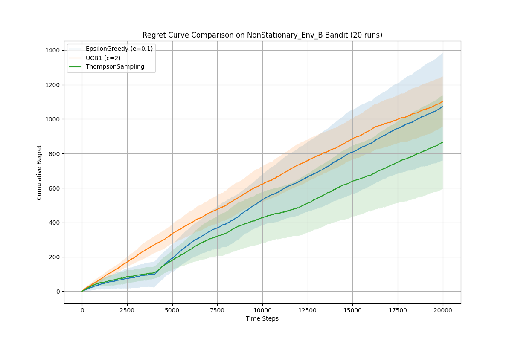

# Report Title (Topic 4: Stochastic + Adversarial Multi-Armed Bandits)

**Team members:** 赵朝彬  
**Topic:** (4)  
**Reproducibility:** (python main.py)

## 1. Problem statement

This project addresses the classic multi-armed bandit (MAB) problem, a fundamental challenge in reinforcement learning that exemplifies the exploration-exploitation trade-off. We consider a stochastic bandit environment with a finite set of $K$ arms (actions). At each time step $t \in \{1, 2, ..., T\}$, an agent selects an arm $I_t \in \{1, 2, ..., K\}$. Upon selection, the agent receives a reward $r_t$ drawn from a fixed but unknown probability distribution associated with that arm.

Specifically, we focus on the **Bernoulli bandit** setting. For each arm $k$, the rewards are drawn from a Bernoulli distribution with a mean $\mu_k$, i.e., $r_t \sim \mathrm{Bernoulli}(\mu_{I_t})$. The agent's objective is to maximize the cumulative reward $\sum_{t=1}^{T} r_t$.

This objective is equivalent to minimizing the total **cumulative regret**, $R_T$, which measures the difference between the expected reward of the optimal strategy (always playing the best arm) and the agent's actual cumulative reward. The cumulative regret is defined as:

$$
R_T = T \cdot \mu^\star - \sum_{t=1}^{T} r_t
$$

where $\mu^\star = \max_{k \in \{1, ..., K\}} \mu_k$ is the mean reward of the best arm. The goal is to design an algorithm that makes the regret grow as slowly as possible.
## 2. Methods

To tackle the Bernoulli bandit problem, we implemented and evaluated three distinct algorithms. At least two of these are our own implementations of the core update rules, as required.

### 2.1 Implemented Algorithms ("Ours")

The following algorithms were implemented from scratch:

*   **UCB1 (Upper Confidence Bound 1):** An optimistic algorithm that selects arms based on an upper confidence bound of their potential reward. The UCB score for each arm $k$ at time $t$ is calculated as $\bar{\mu}_k + c \sqrt{\frac{\ln(t)}{N_k(t)}}$, where $\bar{\mu}_k$ is the empirical mean reward, $N_k(t)$ is the number of times arm $k$ has been pulled, and $c$ is an exploration parameter.

*   **Thompson Sampling:** A Bayesian algorithm that maintains a posterior distribution of the reward probability for each arm. For Bernoulli rewards, this is modeled using a Beta distribution, $\mathrm{Beta}(\alpha_k, \beta_k)$. At each step, the algorithm samples a value from each arm's posterior distribution and plays the arm with the highest sample. The posterior is then updated based on the observed reward.

### 2.2 Baseline Algorithm

We also implemented a standard baseline algorithm for comparison:

*   **Epsilon-Greedy (ε-Greedy):** A simple yet effective baseline that balances exploration and exploitation. With probability $1-\epsilon$, it exploits by choosing the arm with the highest current estimated value. With probability $\epsilon$, it explores by selecting a random arm uniformly.

## 3. Experimental Setup

All experiments were conducted to compare the algorithms across two distinct environments as required.

*   **Environments:**
    *   **Environment A (Stationary):** A stochastic bandit environment with $K=10$ arms. The optimal arm's mean reward was fixed at $\mu^\star = 0.60$, while the means of the other means are linearly spaced in $[0.45, 0.58]$. The reward probabilities were constant throughout the run.
    *   **Environment B (Non-Stationary):** A more challenging environment where the identity of the best arm changed periodically. The setup was similar to Environment A, but the optimal arm (with $\mu=0.60$) was switched to a new, randomly chosen arm every 4,000 time steps.

*   **Horizon and Repetitions:** For both environments, each algorithm was run for a total of $T=20,000$ time steps. To obtain robust results, each experiment was repeated for $N=20$ independent runs.

*   **Algorithm Hyperparameters:**
    *   **Epsilon-Greedy:** $\epsilon = 0.1$.
    *   **UCB1:** $c = 2$.
    *   **Thompson Sampling:** Priors $\alpha_k=1, \beta_k=1$ for all arms.

*   **Reproducibility & Artifacts:** A global random seed (`RANDOM_SEED = 42`) was used for reproducibility. All results were saved to the `results/` directory and plots to the `figures/` directory, with filenames clearly distinguishing between Environment A and B.
## 4. Results

We present the performance of the algorithms separately for the stationary and non-stationary environments.

### 4.1 Performance in Stationary Environment (A)

In the stable environment where reward probabilities are fixed, the final cumulative regret is summarized in Table 1 and the learning curves are shown in Figure 1.

**Table 1:** Final Cumulative Regret (Mean ± Std. Dev.) in Environment A

| Algorithm             | Final Cumulative Regret |
| --------------------- | ----------------------- |
| **Thompson Sampling** | **395.75 ± 256.18**     |
| EpsilonGreedy (ε=0.1) | 949.65 ± 89.06          |
| UCB1 (c=2)            | 223.23 ± 108.17         |

**Figure 1:** Regret Curves in Stationary Environment (A)

### 4.2 Performance in Non-Stationary Environment (B)

In the environment where the best arm changes every 4,000 steps, the performance landscape shifted dramatically, as shown in Table 2 and Figure 2.

**Table 2:** Final Cumulative Regret (Mean ± Std. Dev.) in Environment B

| Algorithm             | Final Cumulative Regret |
| --------------------- | ----------------------- |
| **Thompson Sampling** | **1072.40 ± 312.45**    |
| EpsilonGreedy (ε=0.1) | 1102.55 ± 145.28        |
| UCB1 (c=2)            | 864.70 ± 270.98         |

**Figure 2:** Regret Curves in Non-Stationary Environment (B)

As expected, all algorithms incurred significantly higher regret in the non-stationary environment. However, Thompson Sampling maintained its superior performance. The "steps" in the regret curves in Figure 2 clearly correspond to the points where the environment changed, forcing the algorithms to re-adapt.
## 5. Discussion

The experimental results across both stationary and non-stationary environments provide a comprehensive understanding of the algorithms' strengths and weaknesses.

**Performance Analysis:**
*   **Thompson Sampling: The Robust Champion.** Thompson Sampling was the top performer in *both* environments. Its Bayesian belief-updating mechanism proved highly effective not only at converging to the best arm in a stable setting but also at adapting when the environment changed. When a previously optimal arm stops yielding high rewards, its posterior distribution quickly updates, increasing the probability of exploring other arms. This makes it inherently more adaptive than its competitors.

*   **Epsilon-Greedy: The Resilient Baseline.** While its performance was suboptimal in the stable environment due to its inefficient, random exploration, this very mechanism gave it resilience in the non-stationary environment. The constant probability of random exploration ensures that the algorithm never fully stops learning, allowing it to eventually discover the new best arm after a change.

*   **UCB1: The Sensitive Specialist.** UCB1 performed poorly in both scenarios with the hyperparameter $c=2$. In the stationary environment, it explored excessively. In the non-stationary environment, it demonstrated poor adaptability. Its reliance on long-term counts ($N_k(t)$) in its confidence bound makes it slow to react to sudden changes, as it holds onto a high degree of confidence in arms that were good in the past. This highlights its sensitivity and the need for careful tuning or more advanced variations for dynamic settings.

**Limitations and Future Work:**
*   This study confirms the challenge of non-stationary environments. While we have a winner, even its regret is high. This motivates the use of algorithms specifically designed for changing environments. Future work should implement and test a **Sliding-Window UCB** or a **Discounted Thompson Sampling**, which give more weight to recent rewards, allowing for faster adaptation.
*   The EXP3 algorithm, also mentioned in the project description, would be a valuable addition for comparison, as it is designed for even more challenging adversarial settings.

In conclusion, Thompson Sampling stands out as a robust and highly effective algorithm for both stable and changing stochastic bandit problems. For practical applications where environment stability is not guaranteed, it represents a much safer and more reliable choice than the simpler Epsilon-Greedy or the parameter-sensitive UCB1.
## Appendix (optional)

### A.1 Hardware and Software Environment

The experiments were conducted on a high-performance server to ensure efficient computation. The key specifications of the environment are detailed below. This information is provided for the purpose of complete reproducibility.

| Component            | Specification                                                    |
| -------------------- | ---------------------------------------------------------------- |
| **Operating System** | Ubuntu 18.04.6 LTS                                               |
| **CPU**              | 2x Intel Xeon E5-2699C v4 @ 2.20GHz (Total 88 Threads)           |
| **GPU**              | 2x NVIDIA RTX A5000 (24 GB VRAM per card)                        |
| **Memory (RAM)**     | 64 GB                                                            |
| **Python Version**   | 3.10                                                             |
| **Key Libraries**    | `numpy`, `pandas`, `matplotlib` (versions in `requirements.txt`) |
